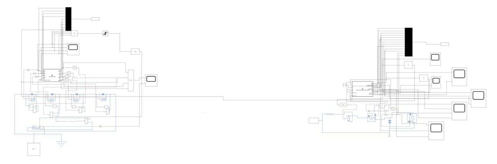
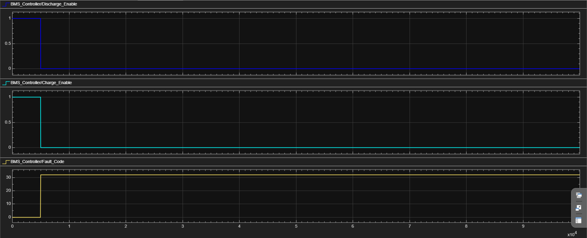
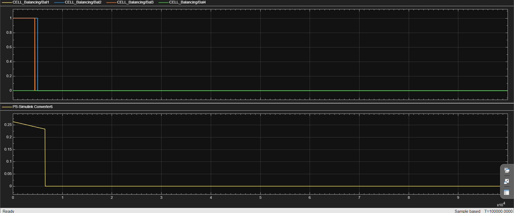

# EV Battery Management System (BMS) Dashboard & Cell Balancing Simulation

## 📄 Project Documentation & Report
Aap is project ki complete technical documentation, formulas aur simulation graphs ki detailed PDF report yahan se direct view aur download kar sakte hain:

👉 **[Download Full Technical Industry Report (PDF)](./Report/BMS_Project_Report(1).pdf)**

---

## 📸 Project Architecture & Simulation Results

*Figure 1: Complete Block Architecture showing Simscape Plant Layer and Control Subsystem Integration.*

<table style="width:100%; display:table;">
  <tr>
    <td style="width:50%; text-align:center;">
      
      <br/><b>Figure 2: Over-Temperature Isolation Logic Waveforms (Fault Code 32)</b>
    </td>
    <td style="width:50%; text-align:center;">
      
      <br/><b>Figure 3: Passive Shunt Equalization and Voltage Trajectory Convergence</b>
    </td>
  </tr>
</table>

---

## 🛠️ Project Overview
This repository contains an automotive-grade Battery Management System (BMS) developed using MATLAB and Simulink for Electric Vehicle (EV) applications. The project focuses on real-time battery parameter monitoring, ISO 26262 functional safety protection alignment, deterministic fault mapping, passive cell balancing loops, and continuous state estimation. The simulation comprehensively demonstrates how an embedded controller protects multi-cell packs and optimizes operational lifespans.

---

## ⚡ Key Features

### 1. Battery Safety & Protection (ASIL-D Alignment)
The BMS continuously monitors the multi-cell pack telemetry and applies strict defensive protection logic when parameters breach electrochemical safety envelopes.
* **Over Voltage (OV)** | **Under Voltage (UV)**
* **Over Current during Charging** | **Over Current during Discharging**
* **Short Circuit Detection (Sub-millisecond Interlock)**
* **Over Temperature (OT)** | **Under Temperature (UT)**
* **Low State of Charge (Critical Low SOC Hysteresis)**

---

### 2. State Estimation
The simulation estimates critical battery parameters with high accuracy:
* **State of Charge (SOC):** Modeled via high-fidelity Coulomb Counting (Ampere-Hour Integration) tracking discrete charging and discharging load trends.
* **State of Voltage (SOV):** Continuously logs internal cell potentials and accounts for transient diffusion dynamics.

---

### 3. Centralized 8-Bit Fault Logging Registry
To optimize bandwidth across standard automotive CAN bus frames, the controller packs multiple asynchronous protection events into a single compressed **8-bit Fault Code (`uint8`)**:

| Monitored Fault System | Bit Placement | Binary Decimal Value | Threshold Boundaries |
| :--- | :---: | :---: | :--- |
| **Over Voltage (OV)** | Bit 0 | 1 | Pack Voltage > 54.0 V |
| **Under Voltage (UV)** | Bit 1 | 2 | Pack Voltage < 42.0 V |
| **Over Current (Charge)** | Bit 2 | 4 | Input Current < -5.0 A |
| **Over Current (Discharge)** | Bit 3 | 8 | Output Current > 8.0 A |
| **Short Circuit (SC)** | Bit 4 | 16 | Shock Current ≥ 20.0 A |
| **Over Temperature (OT)** | Bit 5 | 32 | Core Temperature > 60.0 °C |
| **Under Temperature (UT)** | Bit 6 | 64 | Core Temperature < 0.0 °C |
| **Low SOC Flag** | Bit 7 | 128 | Capacity Level ≤ 20% |

> 📑 **Example Execution:** If an Over-Temperature fault occurs: Core registers `OT = 1`, safety contactors trip (`Charge_Enable = 0`, `Discharge_Enable = 0`), and the CAN-ready diagnostic word broadcasts `Fault Code = 32`.

---

### 4. Deterministic Passive Cell Balancing
The algorithm monitors a four-cell series configuration suffering from manufacturing divergence:
* Continuously tracks and logs the absolute dynamic minimum cell voltage ($V_{min\_ref}$).
* Evaluates cell-to-cell delta matrices: $V_{n} - V_{min\_ref}$.
* Activates individual bypass bleeding shunt switches (`Bal_n = 1`) for any cell exceeding the target tolerance window ($\Delta V_{min} = 20\text{ m V}$).
* Automatically breaks the shunts once voltage equilibrium is achieved across the pack.

---

## 💻 MATLAB & Simulink Framework
* **MATLAB Function Blocks:** Running embedded-ready code optimization scripts.
* **Simscape Battery Components:** Simulating complex non-linear cell physical chemistry.
* **Dashboard Gauges & Lamps:** Providing interactive real-time HMI controls.
* **Structured Bus Elements:** Decoupling high-voltage power paths from logic signaling.

---

## 📂 Folder Structure
```text
EV-BMS-Dashboard-Simulation
├── Simulink_Model/
│   └── BMS_Controller.slx
├── MATLAB_Code/
│   ├── BMS_Controller.m
│   └── Cell_Balancing.m
├── Screenshots/
│   ├── model.png          # Main Model Image
│   ├── fault.png          # Fault Waveforms Graph
│   └── cellbalancing.png  # Balancing Waveforms Graph
├── Report/
│   └── BMS_Project_Report.pdf
└── README.md
🛠️ Technologies Used
MATLAB & Simulink

Simscape Electrical (Physical Systems Modeling)

Embedded C Control Logic Blocks

🚀 Future Horizons
Physical CAN Bus Network Protocols Streaming Integration.

Extended Kalman Filtering (EKF) configurations for State of Health (SOH) Estimation.

Microcontroller target code compilation for ARM Cortex-M (STM32) hardware platforms.

👤 Author
Soumya Shukla

B.Tech in Electrical & Electronics Engineering (6th Semester)

Core Interests: Electric Vehicles (EVs), Battery Management Systems (BMS), Embedded Control Firmware, Power Electronics.
